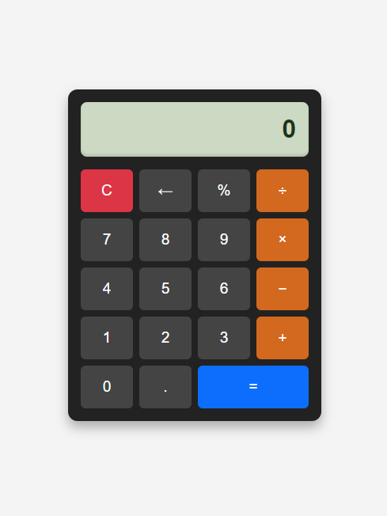

# Retro Calculator App

A retro-inspired calculator app with a modern and minimalist design. Built using **HTML**, **CSS**, and **JavaScript**, this project includes basic calculator functionalities.

## Features

- Perform basic calculations: addition, subtraction, multiplication, and division.
- Includes clear, backspace, percentage, and equals functions.
- Responsive design with a retro-themed display and button layout.
- Hover and active state effects for buttons.

## Screenshots



## How to Use

1. Clone the repository:
   ```bash
   git clone https://github.com/your-username/retro-calculator.git
   ```

2. Navigate to the project directory:
   ```bash
   cd retro-calculator
   ```

3. Open the `index.html` file in your browser to run the app locally.

## Demo

[Live Demo on Render](https://aris-calculator-app.onrender.com)

## Technologies Used

- **HTML** for structure.
- **CSS** for styling.
- **JavaScript** for interactivity.

## Future Enhancements

- Add advanced scientific calculator functions.
- Implement a light/dark mode toggle.
- Include a history feature to view previous calculations.

---

### Credits

- Inspired by a retro calculator aesthetic.

## License

This project is open-source and available under the [MIT License](LICENSE).
